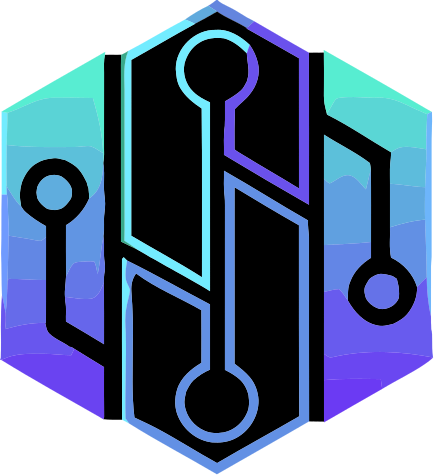

<div align="center">
</div>
<a name="readme-top"></a>

<!-- PROJECT LOGO -->
<br />
<div align="center">
  <h1>O'Boardgame Library</h1>
  <h4>Version 1.0.0</h4>
  <a href="https://github.com/Erik-42">
    
  </a>
</div>

<!-- ABOUT THE PROJECT -->

## About The Project

<div align="center">

[![Contributors][contributors-shield]][contributors-url]
[![Forks][forks-shield]][forks-url]
[![Issues][issues-shield]][issues-url]

<br/>

Repo: [](https://wakatime.com/badge/github/Erik-42/structure-project-generator)
Project: [](https://wakatime.com/badge/user/f84d00d8-fee3-4ca3-803d-3daa3c7053a5/project/4560400d-1de2-4e4e-9af4-393e96928dc8)

</div>

Application web de gestion de collection de jeux de société développée avec React, Redux et Vite.

<p align="right">(<a href="#readme-top">back to top</a>)</p>

## Fonctionnalités

- Gestion complète de votre collection de jeux de société
- Suivi des prêts de jeux
- Système de notation et de commentaires
- Interface utilisateur moderne et réactive
- Installation en tant qu'application PWA (Progressive Web App)
- Authentification des utilisateurs

## Technologies utilisées

- **Frontend**:

  - React 18
  - Redux pour la gestion d'état
  - React Router pour la navigation
  - Vite comme bundler et outil de développement
  - SASS pour les styles

- **Backend**:
  - API REST
  - Authentification JWT

## Installation

### Prérequis

- Node.js (version 16 ou supérieure)
- npm ou yarn

### Instructions d'installation

1. Cloner le dépôt :

   ```bash
   git clone https://github.com/your-username/oboardgame-library.git
   cd oboardgame-library
   ```

2. Installer les dépendances du frontend :

   ```bash
   cd oboardgame-front-vite
   npm install
   ```

3. Configurer les variables d'environnement :

   ```bash
   cp .env.example .env
   # Modifier les variables selon votre configuration
   ```

4. Lancer l'application en mode développement :
   ```bash
   npm run dev
   ```

## Déploiement

Pour construire la version de production :

```bash
npm run build
```

## Tests

Pour lancer les tests :

```bash
npm test
```

## Contribution

Les contributions sont les bienvenues ! N'hésitez pas à ouvrir une issue ou une pull request.

Made with ❤️ et beaucoup de jeux de société !

## Licence

Ce projet est sous licence MIT - voir le fichier [LICENSE](LICENSE) pour plus de détails.

## 👥 Auteur

BasilleCorp - Développement web professionnel

## 📬 Contact

<div align="center">

[![GitHub followers][github followers-shield]][github followers-url]
[![Stargazers][stars-shield]][stars-url]

[![GitHub repo][github repo-shield]][github repo-url]

[](https://wakatime.com/@f84d00d8-fee3-4ca3-803d-3daa3c7053a5)

[![Github Badge][github badge-shield]][github badge-url]
[![LinkedIn][linkedin-shield]][linkedin-url]

[https://buymeacoffee.com/meseneriko](https://buymeacoffee.com/meseneriko)

<a href="https://buymeacoffee.com/meseneriko">
    
</a>  
<p></p>
<p></p>
<a href = 'https://basillecorp.dev'>    basillecorp.dev</a>

mesen.erik@gmail.com

</div>

<p align="right">(<a href="#readme-top">back to top</a>)</p>

<!-- MARKDOWN LINKS & IMAGES -->

[github repo-shield]: https://img.shields.io/badge/Repositories-102-blue
[github repo-url]: https://github.com/Erik-42/Erik-42?tab=repositories
[github badge-shield]: https://img.shields.io/badge/GitHub-100000?style=for-the-badge&logo=github&logoColor=white
[github badge-url]: https://github.com/erik-42
[linkedin-shield]: https://img.shields.io/badge/LinkedIn-0077B5?style=for-the-badge&logo=linkedin&logoColor=white
[linkedin-url]: https://www.linkedin.com/in/erik-mesen/
[github followers-shield]: https://img.shields.io/github/followers/erik-42?style=social
[github followers-url]: https://github.com/erik-42?tab=followers
[stars-shield]: https://img.shields.io/github/stars/erik-42/basillecorp-website?style=social
[stars-url]: https://github.com/erik-42?tab=stargazers
[contributors-shield]: https://img.shields.io/github/contributors/Erik-42/export-project-structure
[contributors-url]: https://github.com/Erik-42/oboardgame-library/graphs/contributors
[forks-shield]: https://img.shields.io/github/forks/Erik-42/export-project-structure
[forks-url]: https://github.com/Erik-42/oboardgame-library/forks
[issues-shield]: https://img.shields.io/github/issues-raw/Erik-42/export-project-structure
[issues-url]: https://github.com/Erik-42/oboardgame-library/issues

</div>
